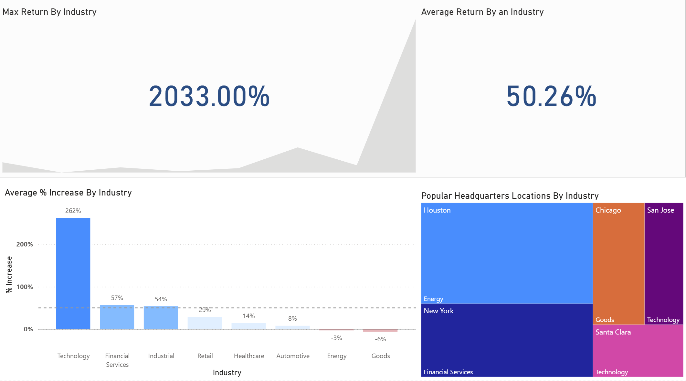
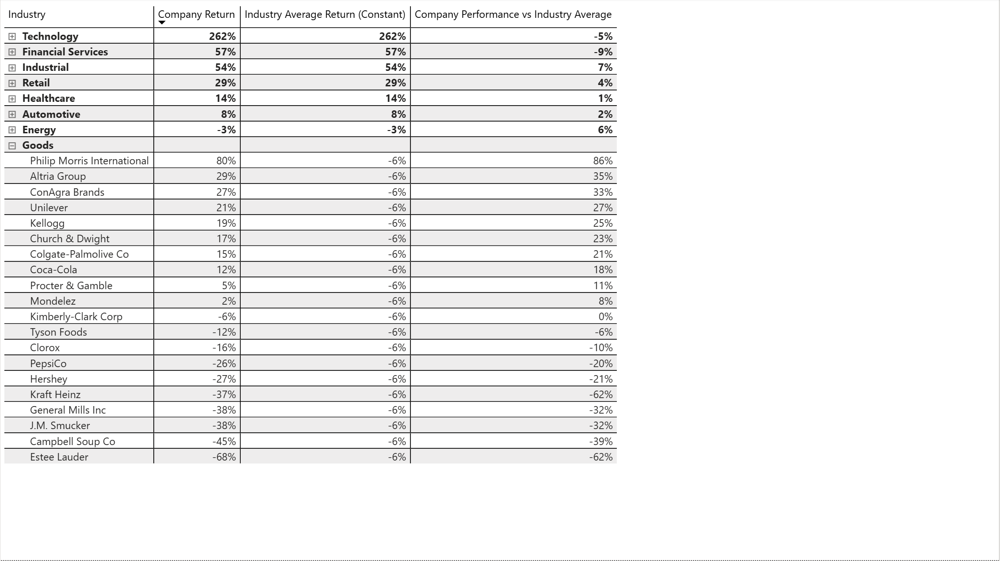

This is an end-to-end data-driven project utilizing Google Sheets, SQL, and Power BI, where I analyzed the stock performance of companies and their industries, as well as the cities where the headquarters are located for 160 companies across eight distinct industries. All of the files I used or created are available in my GitHub repository, in the project linked at the bottom of this page.
## Data Collection (2023-2025)
For this project, I used the 'GOOGLEFINANCE' function in Google Sheets to extract stock data from 160 different companies across eight distinct industries. The data spans two CSV files that are linked by the 'ticker' and 'company_name' attributes.
* 'CompanyInfo.csv' - Contains company information for one hundred and sixty companies across eight distinct industries, with twenty companies per industry. The city where each company is headquartered is also noted.
* 'StockData.csv' - Contains the collected start price, end price, price change, and percent change for each company's stocks, as well as their tickers and company names. The price data spans from 01-01-2023 to 06-30-2025

## SQL Analysis
Using SQL queries and window functions, I created the following:
* Average Percent Increase by Industry: table including industry and average percent increase for a company within said industry
* Highest Return: table containing company name, percent change for said company, and the industry the company is in, sorted by highest % percent change to lowest
* Industry Cities: a table that contains city name, industry, and company count for cities that have the headquarters for three or more companies of the same industry located within them
*  Industry Performers: a table that contains company name, industry, company return, industry average, and the company's performance compared to the industry average
All percentages were rounded to four decimal places and formatted in decimal form.

## Power BI Visualization
In Power BI, my first tab is a dashboard, and my second tab is a matrix.
* Dashboard
    * Max Return By Industry: a KPI visual that shows the percentage of the highest return by a company within the selected industry
    * Average Return By an Industry: a KPI showing a constant value of 50.26% is shown, labeling the average return of all the industries
    * Average % Increase By Industry: a column chart showing the average percentage increase in stock price for each industry when factoring in all of the companies associated with said industry. There is a dashed line in the graph symbolizing the mean % increase, and all bars are color-labeled on a gradient where a deeper blue is a larger increase and a deeper red is a larger decrease.
    * Popular Headquarters Locations By Industry: treemap showing cities and the industry most significantly associated with them.

* Matrix: contains industry, company return, industry average return, and the company performance for each company in each industry. There is a dropdown for each industry containing each company and its performance.

## Link
https://github.com/nathankyryk/google_finance
