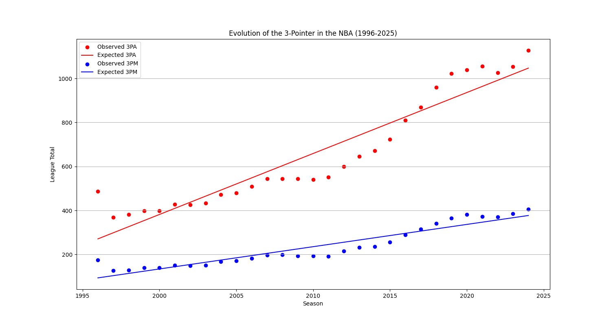
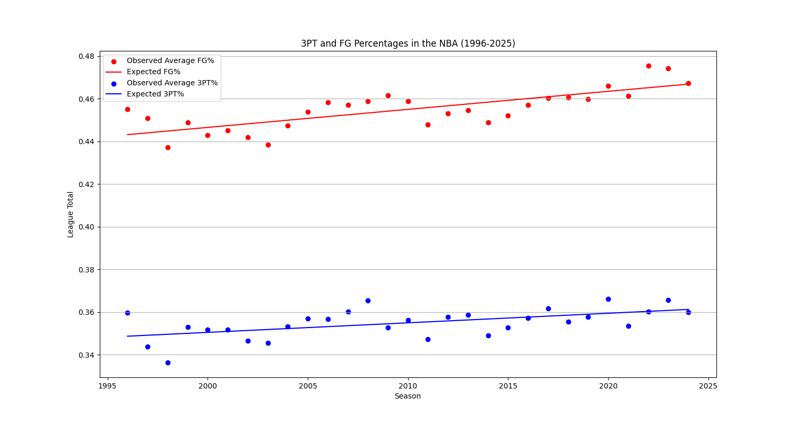

## Project Overview:
With this project, I plan to analyze the evolution of the three-point shot in the NBA. Furthermore, I will examine how the increase in 3-point shots has impacted player metrics, including rebounding and positional roles.

## Data Retrieval:
I will utilize the NBA_api package in Python to retrieve league-wide NBA stats. The three-point line was introduced in 1979, and the dataset begins in 1980. Therefore, I will use data from 1980 to the present.

## Planned Steps:
* Basic Analysis: I will find the regression line for 3PA and 3PM
* Volume and Efficiency: I will look into how overall FG% is affected by the increase in 3PA
* Clustering by Frame: I will look into 3PA, height, weight, and position to analyze how player frames correlate with the increase in 3PA
* Rebounding Analysis: I will look into how 3PA affects rebounding numbers. I plan to test the hypothesis that more 3-pointers lead to an increase in rebounds for smaller players due to a larger bounce off the rim.

## Predictions:
* I expect to see a large jump in 3PA and 3PM over time
* I expect to see a decrease in overall FG%, but an increase in 3PT%
* I expect to see an evolution in the "stretch big", e.g., Dirk Nowitzki, bigger players who would once be expected to be interior players who were dominant from three
* I expect to see an increase in rebounding numbers for perimeter players, due to a larger bounce when shooting from distance

## Updates
* I have created a CSV table with many team stats that I may employ in a future project as well, but I will use it in this project to analyze 3PA, 3PM, team rebounding, FG%, and even blocks, as fewer interior shots should lead to fewer blocks
* CSVs have been created for team stats and player stats from 1996-2025
* Regression line has been plotted with observed values for 3PM and 3PA, and I have summarized key statistics as well, showing that Year is a great estimator for 3PM and 3PA

## Visualization and Analysis of 3PM and 3PA for team statistics from 1996-2025:
Judging the entire league's stats for a single season:
* For each year that passes, the expected value for 3-point attempts increases by 27.717
* For each year that passes, the expected value for 3-point makes increases by 10.124 
* The r^2 is high and the p-value is low for both the 3PM and 3PA statistics
* We would reject the null hypothesis that the year is not a significant predictor for both 3PM and 3PA, even when using a very small alpha like .001
* Year is a great estimator for both 3PM and 3PA
  

## Visualization and Analysis of FG% and 3PT% for team statistics from 1996-2025:

[Repository Link](https://github.com/nathankyryk/nba)
